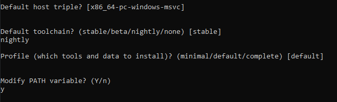
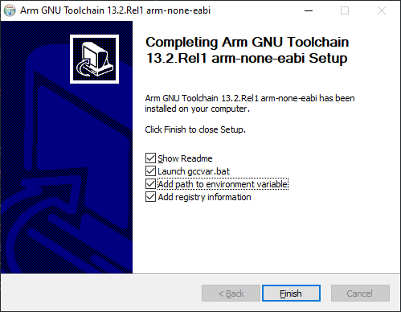

# VEX V5 Template for the Rust Programming Language

## Getting Started (Windows)

### Install Rust

Install Rust by following the instructions on https://rustup.rs/. You may be prompted to install Visual Studio during the installation. When prompted which action to choose, customize your installation. Choose a `nightly` toolchain, and keep other default values.

### Install pros-rs

Pros-rs is a toolchain for developing VEX robots in Rust. Start by installing the [ARM EABI Toolchain](https://developer.arm.com/downloads/-/arm-gnu-toolchain-downloads), downloading the first `exe` installer file under the header **arm-none-eabi**. This is a very slow download and might take up to 15 minutes. This tool is required to build the robot code. You will need admin permissions to run the installer.

_Make sure to check "Add path to environment variable"!_

